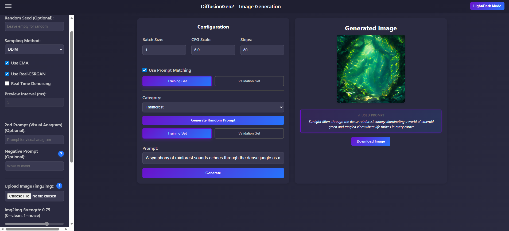
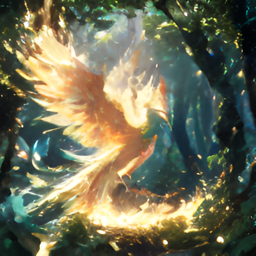
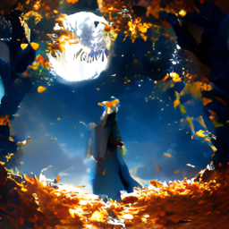
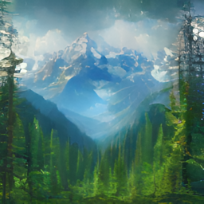

# Hi there! 👋 I'm Ivan  
🚀 Computer Science student | 🤖 AI/ML Enthusiast

## 🏆 Featured Project: SimpleLLaMA

SimpleLLaMA is a modular, educational framework that reproduces the full training and alignment pipeline of modern Large Language Models (LLMs) - from pretraining to Supervised Fine-Tuning (SFT) and Direct Preference Optimization (DPO) for RLHF alignment.

This project implements a 1.3B-parameter Transformer model inspired by LLaMA, trained on the FineWebEdu corpus, and includes complete scripts for dataset handling, distributed training, benchmarking (via EleutherAI’s lm-eval-harness), and interactive inference.

  Primary Documentation Page
    
  

💡 Designed to demystify how LLMs are built and aligned, it serves both as an educational tool and a research framework for exploring model behavior.

🔗 **GitHub Repo**: [SimpleLLaMA](https://github.com/IvanC987/SimpleLLaMA)

📘 **Docs**: [Project Documentations](https://ivanc987.github.io/SimpleLLaMA/)

---

## 🎨Project: DiffusionGen2.0:
DiffusionGen2 is a research-oriented latent diffusion system focuses more on experimental inference features, built as a successor to DiffusionGen (v1).

Unlike v1, which was more of a baseline end-to-end generation pipeline, DiffusionGen2 is more about advanced diffusion techniques like (actual) real-time denoising previews, prompt alignment, latent-space img2img/in-painting, and experimental sampling methods like visual anagrams.

The model is trained from scratch in PyTorch and integrates external components like Stable Diffusion's VAE, CLIP for text conditioning, and Real-ESRGAN for better image quality. Training incorporates Min-SNR loss weighting, EMA, multiple noise schedules, and v-prediction to improve both quality and efficiency.

The project provides a FastAPI backend and an interactive web interface, designed as a research sandbox for inspecting and extending diffusion behavior rather than a full production system.

 

  Prompt: A weathered dragon perched on a cliff, its scaled hide rattling in the wind as distant storm clouds gather.  
    
  

 

  Front-end UI
    
  

| Image 1 | Image 2 | Image 3 |
|:-------:|:-------:|:-------:|
|  |  |  |

🔗 **GitHub Repo**: [DiffusionGen2](https://github.com/IvanC987/DiffusionGen2.0)  
🔗 **Previous Version**: [DiffusionGen v1](https://github.com/IvanC987/DiffusionGen)

---

### 🧉 Other Projects:

🔗 **GitHub Repo**: [SemanticSegmentationModel](https://github.com/IvanC987/SemanticSegmentationModel) - Implements a U-Net model for semantic segmentation, designed to classify and segment objects within images at a pixel level. The model is trained using the Cityscapes dataset and optimized for accuracy in real-world segmentation tasks.

🔗 **GitHub Repo**: [TransformerLM](https://github.com/IvanC987/TransformerLM) - Implements a Transformer-based language model from scratch, integrating Byte Pair Encoding (BPE) for efficient tokenization. This project aims to provide a deeper understanding of how Transformers process and generate text at a more granular level.

🔗 **GitHub Repo**: [LanguageTranslationModel](https://github.com/IvanC987/LanguageTranslationModel) - Builds a sequence-to-sequence translation model based on the Transformer architecture. The project focuses on neural machine translation, using self-attention mechanisms for text generation.

---

## 🔧 Technologies & Tools I Use

## 📫 How to Reach Me
- Email: IvanC135246@gmail.com  
- LinkedIn: [https://linkedin.com/in/IvanC987](https://www.linkedin.com/in/Ivan-Cao-CS/)

 

### 🚀 Next Project: Revisiting Image Generation
My next project is about revisiting my DiffusionGen project, focusing on using better dataset, enhancing features like CFG and in-painting, and adding various adjustments

