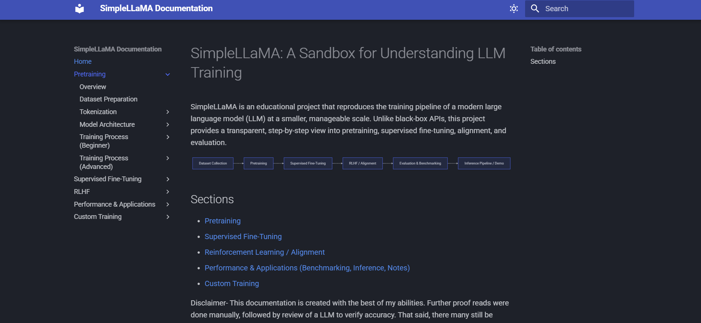

# Hi there! 👋 I'm Ivan  
🚀 Computer Science student | 🤖 AI/ML Enthusiast

## 🏆 Featured Project: SimpleLLaMA

SimpleLLaMA is a modular, educational framework that reproduces the full training and alignment pipeline of modern Large Language Models (LLMs) - from pretraining to Supervised Fine-Tuning (SFT) and Direct Preference Optimization (DPO) for RLHF alignment.

This project implements a 1.3B-parameter Transformer model inspired by LLaMA, trained on the FineWebEdu corpus, and includes complete scripts for dataset handling, distributed training, benchmarking (via EleutherAI’s lm-eval-harness), and interactive inference.

  Prompt: The night sky stretches endlessly above a snow-covered winter landscape, shimmering with countless stars and the faint glow of the aurora borealis.
    
  

💡 Designed to demystify how LLMs are built and aligned, it serves both as an educational tool and a research framework for exploring model behavior.

🔗 **GitHub Repo**: [SimpleLLaMA](https://github.com/IvanC987/SimpleLLaMA)

📘 **Docs**: [Project Documentations](https://ivanc987.github.io/SimpleLLaMA/)

---

## 🎨Project: DiffusionGen:
DiffusionGen is a Flask-based GUI built for latent diffusion image generation, providing advanced user controls such as prompt input, image-to-image generation, and upscaling. The core diffusion model was implemented and trained entirely from scratch using PyTorch, without reliance on prebuilt diffusion libraries. The backend is designed for customization and extensibility, incorporating pretrained models—including Stable Diffusion’s VAE, CLIP for text embeddings, Real-ESRGAN for upscaling, and VGG16 for perceptual loss—into a tailored Latent Diffusion Model pipeline for improved image synthesis.

  

  Prompt: The night sky stretches endlessly above a snow-covered winter landscape, shimmering with countless stars and the faint glow of the aurora borealis.
    
  

 

🔗 **GitHub Repo**: [DiffusionGen](https://github.com/IvanC987/DiffusionGen)

---

### 🧉 Other Projects:
🔗 **GitHub Repo**: [SemanticSegmentationModel](https://github.com/IvanC987/SemanticSegmentationModel) - Implements a U-Net model for semantic segmentation, designed to classify and segment objects within images at a pixel level. The model is trained using the Cityscapes dataset and optimized for accuracy in real-world segmentation tasks.

🔗 **GitHub Repo**: [TransformerLM](https://github.com/IvanC987/TransformerLM) - Implements a Transformer-based language model from scratch, integrating Byte Pair Encoding (BPE) for efficient tokenization. This project aims to provide a deeper understanding of how Transformers process and generate text at a more granular level.

🔗 **GitHub Repo**: [LanguageTranslationModel](https://github.com/IvanC987/LanguageTranslationModel) - Builds a sequence-to-sequence translation model based on the Transformer architecture. The project focuses on neural machine translation, using self-attention mechanisms for text generation.

---

## 🔧 Technologies & Tools I Use

## 📫 How to Reach Me
- Email: IvanC135246@gmail.com  
- LinkedIn: [https://linkedin.com/in/IvanC987](https://www.linkedin.com/in/Ivan-Cao-CS/)

 

## 🔭 What I'm Working On
- Researching Transformer-based architectures
- Improving DiffusionGen with better UI/UX
- Learning model quantization, LoRA, and others for optimizing LLMs

 

### 🚀 Next Project: Revisiting `LangugageTranslationModel`
My next goal is to revisit my Translation Model project, focusing on using better dataset, enhancing accuracy, adding various adjustments

